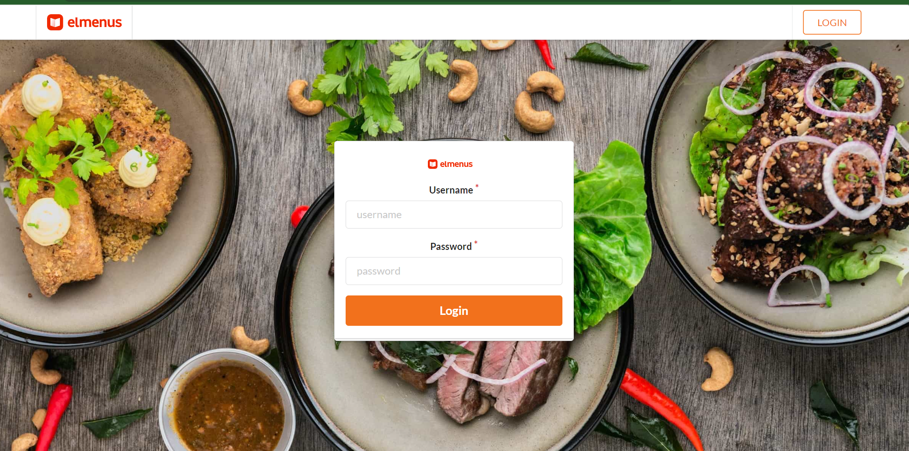
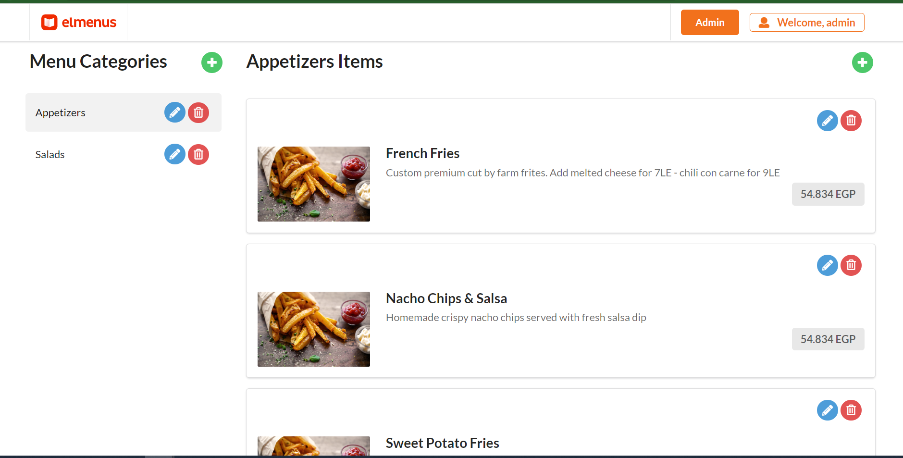
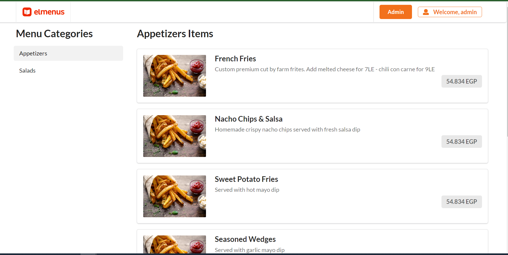
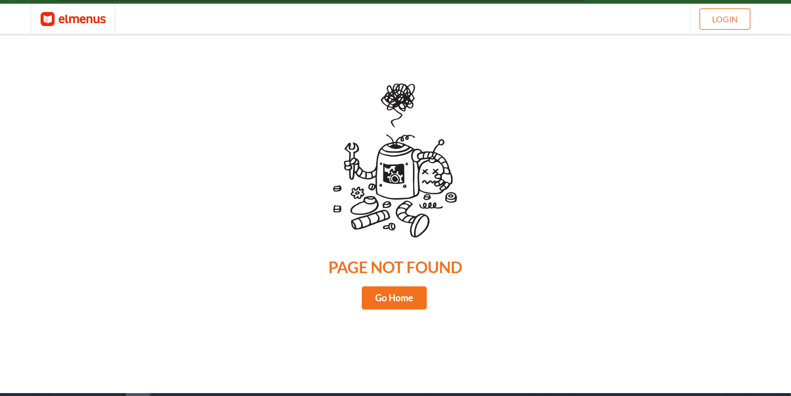

# El-menus App

A simple of elmenus app from user and Admin perspective. 
Admin can add, delete and update the menu categories and the category items.
User can just view the menu page.

## Screenshots

<p align="center">
  
  
  
  
</p>

## Technology Stack

- **ReactJS** Create-react-app
- **TypeScript**
- **Json-Server** for Fake APIs
- **context-API** for global state
- **Sass** for styling


### Used Packages

- Axios
- react-query
- react-semantic-ui
- react-toastify

## Development

### Main Project

1. Clone the source code from `https://github.com/hamed-farag/todo.git`
2. In your terminal, navigate to the project directory and execute `npm install`
3. After the previous step, execute `npm run server` to run json-server for fake APIs (http://localhost:8000).
5. In a new terminal instance, run `npm run start` to run the project locally.
6. Visit [http://localhost:3000](http://localhost:3000)

Administrator Credential
- Username: admin
- password: admin

### File Structure

```
.
├── docs                                # postman collection file for all APIS
├── public                              
│   └───images                          # all images needed in the project
├── screenshots                         # screenshots for all pages
├── server                              # db.json that used by json-server
├── src
│   ├───components                      # all reusable components
│   │   ├───EmptyState                  # empty component handle empty status
│   │   ├───Header                      # main header for all pages
│   │   └───Popup                       # popup component for add/edit forms
│   ├───context                         # for storing the logged user data
│   ├───data                            # data layer that consumingthe APIS
│   ├───helpers                         # contains a usefull and reusable functions
│   ├───interfaces                      # interfaces for typescript
│   ├───pages
│   │   ├───404                         # Not found page
│   │   ├───EditingPage                 # the Admin page that list menu catgories and items and 
│   │   │   │                             can add/edit/update/delete categories and items.
│   │   │   └───components
│   │   │       ├───AddCategory         # componet for add category
│   │   │       ├───AddCategoryItem     # componet for add category item
│   │   │       ├───EditCategory        # componet for edit category
│   │   │       ├───EditCategoryItem    # componet for edit category item
│   │   │       ├───ModifyingMenu       # listing all category items
│   │   │       └───ModifyingSideBar    # listing all categories
│   │   ├───LoginPage                   # login page for admis to can modify categories and items.
│   │   └───RestaurantPage              # the landing page that list menu catgories and items.
│   │       └───components
│   │           ├───Menu                # listing all category items
│   │           └───SideBar             # listing all categories
│   ├───services                        # wrapper for http calls
│   ├───styles                          # contained mixins for repeated styles
│   ├───transformers                    # transform data shape
│   ├───apiURLs.ts                      # contains the URLS for APIs
│   ├───App.tsx
│   └───index.tsx
```

## Avaliable APIS

[Postman Collection](https://github.com/Khaled-Alaa/elmenus/blob/main/docs/elmenus-collection.postman_collection.json)

